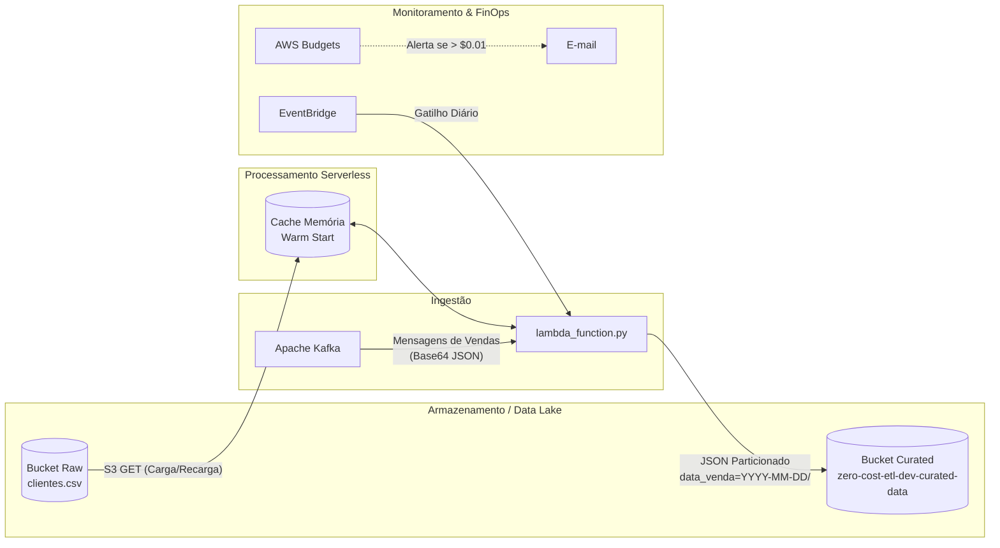

# Pipeline ETL Serverless e Arquitetura de Infraestrutura (FinOps)

Este projeto implementa a evolução de um pipeline de ETL (Extract, Transform, Load) em lote para uma arquitetura **Serverless orientada a eventos na AWS**. 

O sistema consome mensagens/eventos de vendas transmitidos via **Apache Kafka** em tempo real, enriquece as transações cruzando-as com uma base cadastral de clientes hospedada no **Amazon S3** (com otimização de cache em memória) e armazena os dados finais no Data Lake na camada consolidada (**Curated**) de forma particionada (Hive Partitioning).

Toda a infraestrutura é provisionada via **Terraform** seguindo rígidos conceitos de **FinOps**, garantindo a operação dentro do **AWS Free Tier** (Limite Gratuito) através de regras de ciclo de vida automáticas no S3 e limites de orçamento configurados no AWS Budgets.

---

## 🛠️ Tecnologias Utilizadas

* **Linguagem:** Python 3.10
* **Computação/Serverless:** AWS Lambda
* **Armazenamento (Data Lake):** Amazon S3
* **Orquestração/Agendamento:** Amazon EventBridge (CloudWatch Events)
* **Ingestão/Mensageria:** Apache Kafka (Self-Managed ou AWS MSK)
* **Infraestrutura como Código (IaC):** Terraform >= 1.0.0
* **FinOps:** AWS Budgets & Políticas de Ciclo de Vida do S3 (S3 Lifecycle Rules)
* **Bibliotecas Auxiliares:** `boto3` (AWS SDK para Python), `csv`, `json`, `base64`, `unittest`

---

## 📂 Estrutura do Projeto

```text
├── src/
│   └── lambda_function.py     # Código principal do pipeline ETL na AWS Lambda
├── terraform/
│   ├── main.tf                # Configurações de provedor (AWS) e variáveis globais
│   ├── s3.tf                  # Criação de buckets (Raw/Curated) e regras de ciclo de vida S3
│   ├── lambda.tf              # Recursos da AWS Lambda, permissões IAM e variáveis de ambiente
│   ├── eventbridge.tf         # Disparador diário agendado para o Lambda
│   └── finops_budgets.tf      # Orçamento AWS Budgets e alertas de e-mail para custos
├── test_lambda.py             # Suite de testes unitários e mocks para a Função Lambda
├── .gitignore                 # Arquivos ignorados pelo Git
└── README.md                  # Documentação do projeto
```

---

## 🚀 Arquitetura e Fluxo de Dados



### 1. Ingestão & Processamento (AWS Lambda)
A função [lambda_function.py](file:///c:/Projetos/etl-pyspark/src/lambda_function.py) é acionada por eventos do Apache Kafka. Ela decodifica o payload base64 que contém a transação de venda e processa os dados de forma individual.

### 2. Otimização de Carga de Dimensão (Warm Start Cache)
Para evitar que o Lambda faça requisições GET constantes ao S3 a cada mensagem recebida (reduzindo latência e economizando custos com requisições do S3), a base cadastral [clientes.csv](file:///c:/Projetos/etl-pyspark/src/lambda_function.py#L15) é armazenada temporariamente na memória do contêiner (`CACHE_CLIENTES`). 
* O cache é atualizado caso esteja vazio ou tenha sido carregado há mais de **10 minutos** (600 segundos).

### 3. Transformação & Qualidade de Dados
* **Cálculo de Idade:** Calcula a idade aproximada com base no ano corrente e a data de nascimento do cliente.
* **Faixa Etária:** Classifica o cliente em quatro grupos:
  * `Menor de Idade` (< 18 anos)
  * `Jovem Adulto (18-29)` (18 a 29 anos)
  * `Adulto (30-49)` (30 a 49 anos)
  * `Senior (50+)` (>= 50 anos)
* **Join:** Enriquece a transação injetando nome, idade e faixa etária do cliente.

### 4. Particionamento (Data Lake)
As transações enriquecidas são salvas individualmente em formato JSON no bucket de dados consolidados (Curated), imitando o formato de particionamento Hive:
`vendas_detalhadas/data_venda=YYYY-MM-DD/venda_ID.json`

---

## 💵 Governança de Custos e FinOps

Para assegurar que o projeto nunca gere custos indesejados durante o desenvolvimento ou testes, as seguintes proteções foram implementadas via Terraform:

1. **AWS Budgets ([finops_budgets.tf](file:///c:/Projetos/etl-pyspark/terraform/finops_budgets.tf)):**
   * Configura um orçamento mensal de **USD 0.01** (1 centavo).
   * Dispara um e-mail de alerta caso os custos reais atinjam **80%** do limite (USD 0.008) ou caso a projeção (Forecasted) mensal atinja **100%** do limite.
2. **Ciclo de Vida no S3 ([s3.tf](file:///c:/Projetos/etl-pyspark/terraform/s3.tf#L50-L86)):**
   * **Dados Brutos (Raw):** Expiração automática após **14 dias** e exclusão de versões não correntes após **7 dias**.
   * **Dados Consolidados (Curated):** Expiração automática após **90 dias** e exclusão de versões não correntes após **30 dias**.
   * Isso evita o acúmulo de arquivos que excedam o limite gratuito de **5 GB** do Amazon S3.

---

## 🛠️ Como Implantar a Infraestrutura (Terraform)

### 1. Pré-requisitos
* Ter o [Terraform](https://www.terraform.io/) instalado localmente.
* Credenciais da AWS configuradas no seu ambiente (`aws configure` ou via variáveis de ambiente).

### 2. Inicialização e Deploy
Navegue até a pasta de infraestrutura e execute os comandos:

```bash
cd terraform
terraform init
terraform plan
terraform apply
```

*Nota: Por padrão, os buckets S3 e o Lambda serão criados na região `us-east-1` sob o ambiente `dev` (`zero-cost-etl-dev-raw-data` e `zero-cost-etl-dev-curated-data`).*

### 3. Carga do Cadastro de Clientes
Após o deploy, você deve fazer o upload do arquivo `clientes.csv` na raiz do bucket S3 raw criado para que a Lambda consiga cruzar as vendas.
```bash
aws s3 cp dados/clientes.csv s3://zero-cost-etl-dev-raw-data/clientes.csv
```

---

## ✅ Testes Automatizados

Os testes do Lambda validam o comportamento das funções de cálculo de idade, classificação de faixa etária, leitura/parse do S3 e simulam uma invocação completa do Lambda a partir de um evento mockado do Kafka.

Para rodar a suíte de testes unitários localmente (sem precisar de infraestrutura na AWS):

```bash
python test_lambda.py
```

### O que é testado em [test_lambda.py](file:///c:/Projetos/etl-pyspark/test_lambda.py):
* `test_carregar_clientes_do_s3`: Simula o download do `clientes.csv` via S3 Mock (boto3 API) e valida o parser e cache.
* `test_calcular_idade`: Valida a lógica de cálculo de idade para anos bissextos e datas variadas.
* `test_categorizar_faixa_etaria`: Valida se os limites de idade classificam corretamente o cliente.
* `test_lambda_handler_sucesso`: Simula o payload de mensagens do Kafka codificado em base64, o processamento da função e a chamada correspondente de escrita no S3 curated (`put_object`) com o caminho particionado correto.
